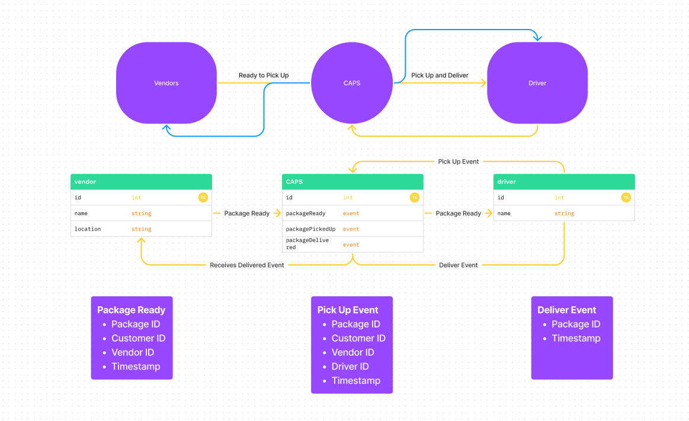

# event-driven-server

## Lab 11: Authentication

## Author: Derek "Dougie" Douglas

## UML

## Collaborators: David Southard, Hugo Thompson, Zayah Lang

- Zayah helped me change how I was implementing my emits and Hugo helped me to understand how I was passing the package along, as well as implementing the sleep functionality.

## Links

## Time

- Total time: ~4 hours

## Lessons Learned

- This lab was definitely simple in idea, but was a little awkward to write at first. I spent a long time just tinkering with console logs in conjunction with the event listeners and emitters. The next step will be focusing on testing.
